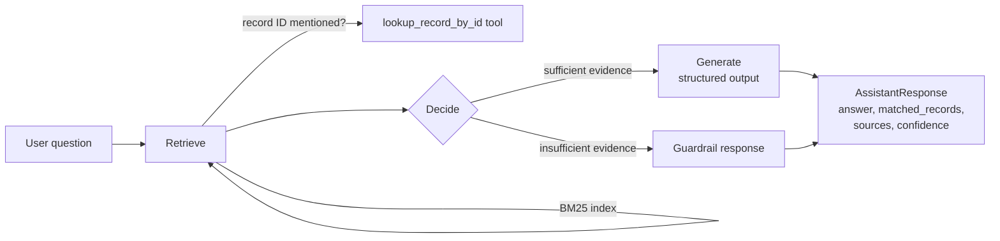

# Knowledge Base Assistant

[](https://www.python.org/)
[](https://www.langchain.com/)
[](https://docs.pytest.org/)
[](#license)

A small, production-style **LangChain** application that answers questions using
a local knowledge base. It demonstrates model integration, prompt design,
structured output, tool use, retrieval, observability, and evaluation — end to
end, with a fully offline test suite.

The default model provider is **Groq** (`llama-3.3-70b-versatile`); OpenAI,
Anthropic, and local Ollama are also supported via a config switch.

---

## Table of contents

- [Features](#features)
- [Project structure](#project-structure)
- [How it works](#how-it-works)
- [Setup](#setup)
- [Usage](#usage)
- [Example output](#example-output)
- [Model providers](#model-providers)
- [Tests](#tests)
- [Evaluation](#evaluation)
- [Design notes](#design-notes)
- [License](#license)

---

## Features

- 🔍 **Retrieval** over a local CSV knowledge base using BM25 — no embedding
  API key required
- 🛠️ **Exact-ID lookup tool** for precise, hallucination-free answers on
  known records
- 🧩 **Structured output** with schema validation, automatic repair, and
  retry logic for unreliable providers
- 🛡️ **Two-layer guardrails** that flag low-confidence or unsupported
  answers for human review
- 📊 **Observability** — request-level logging plus optional LangSmith
  tracing
- ✅ **Offline test suite** and a **14-case evaluation harness** against the
  real model

## Project structure

```
knowledge_assistant/
├── README.md
├── requirements.txt
├── .env.example
├── data/
│   └── knowledge_base.csv        # 24 knowledge records
├── src/
│   ├── config.py                 # env-based settings (secrets via .env)
│   ├── models.py                 # KnowledgeRecord + AssistantResponse schemas
│   ├── retrieval.py              # split + BM25 index + retriever
│   ├── tools.py                  # lookup_record_by_id tool
│   ├── structured.py             # resilient JSON structured output (repair/retry)
│   ├── agent.py                  # LangGraph agent, guardrails, logging, LangSmith
│   └── main.py                   # CLI
├── tests/
│   ├── test_agent.py             # offline pipeline tests (fake LLM)
│   └── test_structured.py        # structured-output repair logic tests
└── evaluation/
    ├── test_cases.csv            # 14 test cases
    └── run_evaluation.py         # evaluation harness
```

## How it works



1. **Retrieval** — each record is loaded from CSV, split with a recursive
   character splitter, and indexed with BM25 (`rank_bm25`). This needs no
   embedding API key, is deterministic, and returns interpretable scores that
   drive the guardrail.
2. **Tool** — `lookup_record_by_id` fetches an exact record by ID. The agent
   calls it whenever the question mentions a record ID (regex `KB-\d{4}`).
3. **Agent** — a small LangGraph state machine: `retrieve` (BM25 + optional
   lookup tool) → `decide` → `generate` (structured LLM output) or `guardrail`
   (insufficient evidence).
4. **Structured output** — the model is wrapped in a resilient
   `StructuredGenerator` (`json_mode` + defensive parsing + type repair + one
   corrective retry). It returns `answer`, `matched_records`, `sources`,
   `confidence`, `needs_human_review`. `sources` is then reconciled against the
   cited record IDs so it always contains the real source document names.
5. **Observability** — every request logs a request ID, question, retrieved
   IDs, tool calls, token usage, execution time, and errors. LangSmith tracing
   is enabled automatically when `LANGCHAIN_API_KEY` is set.

## Setup

```bash
cd knowledge_assistant
python3 -m venv .venv && source .venv/bin/activate
pip install -r requirements.txt

cp .env.example .env
# edit .env and set GROQ_API_KEY (get one at https://console.groq.com)
```

## Usage

```bash
# single question (prints JSON)
python -m src.main "What is the remote work policy in KB-0001?"

# interactive REPL
python -m src.main

# list all record IDs
python -m src.main --list-records
```

## Example output

```json
{
  "answer": "Employees may work remotely up to 4 days per week with manager approval...",
  "matched_records": ["KB-0001"],
  "sources": ["HR Handbook v4.2"],
  "confidence": 0.95,
  "needs_human_review": false
}
```

When evidence is insufficient (e.g. unsupported request or invalid record ID),
the agent responds that the information is unavailable, sets
`needs_human_review=true`, and sets `confidence=0.0`.

## Model providers

| Provider | `MODEL_PROVIDER` | `MODEL_NAME` example | Key |
|----------|------------------|----------------------|-----|
| Groq (default) | `groq` | `llama-3.3-70b-versatile` | `GROQ_API_KEY` |
| OpenAI | `openai` | `gpt-4o-mini` | `OPENAI_API_KEY` |
| Anthropic | `anthropic` | `claude-3-5-haiku-latest` | `ANTHROPIC_API_KEY` |
| Ollama (local) | `ollama` | `llama3.1` | none |

## Tests

The test suite runs fully offline (the LLM is stubbed) and covers retrieval,
the lookup tool, guardrails, and pipeline behavior.

```bash
pytest -q
```

## Evaluation

14 hand-written cases cover **exact lookup, comparison, filtering, unsupported
requests, ambiguity, and invalid IDs** (see `evaluation/test_cases.csv`).

```bash
python -m evaluation.run_evaluation
```

This calls the real model, checks retrieved records and guardrail flags against
expectations, and writes `evaluation/evaluation_results.json`. Note: the
comparison/ambiguity cases are LLM-judged — inspect the `answer` column, since
the exact wording varies by model.

## Design notes

- **BM25 beats embeddings here.** The dataset is small (24 short records) and
  lexical overlap on titles/keywords is enough for high-precision retrieval,
  with zero embedding cost and no extra API key. For larger corpora, swap in a
  vector store (e.g. Chroma + any embedding model) — the `BaseRetriever`
  interface makes that a drop-in change.
- **Tool vs. retrieval complement each other.** An exact-ID question gets the
  record verbatim from the tool; free-form questions rely on BM25. This avoids
  the model "hallucinating" a record from fuzzy retrieval. The tool is invoked
  once per distinct ID mentioned, so comparison questions fetch both records.
- **Groq/Llama structured output is unreliable with strict tool-calling.**
  `with_structured_output`'s default tool-calling mode 400s on Groq when Llama
  emits array fields as strings (e.g. `"matched_records": "[KB-0011, KB-0012]"`).
  Switching to `json_mode` + a repair layer (coerce strings back to arrays,
  floats, booleans) + one corrective retry made it 14/14 across the eval suite.
- **Never trust the model's `sources` field directly.** It repeatedly returned
  keywords instead of document names, so `sources` is reconciled
  deterministically from `matched_records` against the knowledge base.
- **Guardrail is two-layered.** The graph short-circuits to
  `needs_human_review=true` when the exact-ID tool reports an unknown ID or no
  retrieved score clears the BM25 threshold, and the prompt instructs the model
  to flag ambiguity / low confidence too. Prompt-tuning was needed so "list"
  questions don't get over-flagged just because some context blocks are unused.
- **CSV hygiene matters.** A comma inside an unquoted CSV field silently shifts
  columns — the `source` field was being parsed as a keyword, which corrupts
  retrieval context and the model's citations. All fields are now written with
  proper CSV quoting.
- **Confidence calibration.** `confidence` is model-judged; Groq's Llama-3.3
  was found to be well calibrated on this dataset but it is not verified
  against ground truth — treat it as a soft signal and rely on
  `needs_human_review` for hard failures.
- **LangSmith** activates only when `LANGCHAIN_API_KEY` is present, so the app
  is fully usable (and testable) without any observability credentials.

## License

This project is licensed under the MIT License. See [`LICENSE`](LICENSE) for
details.
